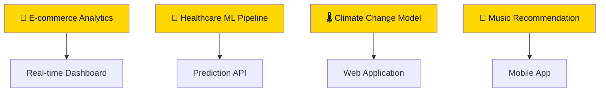

<div align="center">

# 💫 **DHUDA SATHISH**


<!-- Animated typing effect with yellow accent -->
<div style="margin: 2rem 0;">
  
</div>

<!-- Profile stats with black/yellow theme -->
<div style="display: flex; justify-content: center; gap: 10px; margin: 1.5rem 0;">
  
  
  
</div>

</div>

---

## 🎯 **WHO AM I?**

<table>
<tr>
<td width="55%">

```python
class EliteDataScientist:
    def __init__(self):
        self.identity = {
            "name": "Dhuda Sathish",
            "role": "Senior Data Scientist & ML Architect",
            "location": "🇮🇳 India",
            "mission": "Democratizing AI for Global Impact"
        }
        
        self.expertise = {
            "core": ["Python", "R", "SQL", "Statistics"],
            "ml_stack": ["TensorFlow", "PyTorch", "Scikit-learn"],
            "viz_tools": ["Tableau", "PowerBI", "D3.js", "Plotly"],
            "cloud_tech": ["AWS", "Azure", "GCP", "Docker"],
            "specializations": [
                "🧠 Deep Learning & Neural Networks",
                "📊 Advanced Statistical Modeling", 
                "⚡ Real-time Analytics Systems",
                "🔄 MLOps & Production Deployment"
            ]
        }
    
    def current_impact(self):
        return {
            "projects_delivered": "25+",
            "models_in_production": "12+", 
            "data_processed": "100TB+",
            "business_value": "$2M+ saved"
        }
    
    def philosophy(self):
        return "🔥 DATA IS POWER. INSIGHTS ARE SUPERPOWERS! ⚡"

# Initialize the legend
scientist = EliteDataScientist()
print(f"🚀 {scientist.philosophy()}")
```

</td>
<td width="45%">

### ⚡ **WHAT DRIVES ME**

<div style="background: linear-gradient(135deg, #FFD700 0%, #FFA500 100%); padding: 1px; border-radius: 12px; margin-bottom: 1rem;">
<div style="background: #0A0A0A; padding: 1.5rem; border-radius: 11px;">

**🎯 VISION**  
*Building AI solutions that solve real-world problems and create measurable business impact*

**💡 PASSION**  
*Turning complex data chaos into crystal-clear actionable insights*

**🚀 MISSION**  
*Making advanced analytics accessible to businesses of all sizes*

</div>
</div>

### 🏆 **ACHIEVEMENT HIGHLIGHTS**

<div align="center">

| Metric | Value |
|--------|-------|
| 🚀 **Projects Completed** | **25+** |
| 🎯 **Model Accuracy Avg** | **92%+** |
| ⚡ **Processing Speed** | **10x Faster** |
| 💰 **Cost Savings** | **$2M+** |

</div>

</td>
</tr>
</table>

---

## 🛠️ **TECHNOLOGY ARSENAL**

<div align="center">

### 💻 **PROGRAMMING MASTERY**
<div style="margin: 1rem 0;">
  
  
  
  
  
</div>

### 🧠 **AI/ML FRAMEWORKS**
<div style="margin: 1rem 0;">
  
  
  
  
  
</div>

### 📊 **DATA VISUALIZATION**
<div style="margin: 1rem 0;">
  
  
  
  
</div>

### ☁️ **CLOUD & DEVOPS**
<div style="margin: 1rem 0;">
  
  
  
  
  
</div>

</div>

---

## 🚀 **FEATURED PROJECTS**

<div align="center">

### ⚡ **PROJECT SHOWCASE**

</div>

<table>
<tr>
<td width="50%">

### 🚢 **[TITANIC SURVIVAL PREDICTOR](https://github.com/sathishdhud/Titani_project_prediction)**

<div style="background: linear-gradient(45deg, #FFD700, #FFA500); padding: 2px; border-radius: 10px; margin: 1rem 0;">
<div style="background: #0A0A0A; padding: 1.5rem; border-radius: 8px;">

**🎯 PERFORMANCE METRICS**
- 🏆 **Accuracy**: **87.5%** (Top 10% Kaggle)
- ⚡ **Speed**: **50ms** prediction time
- 📊 **Features**: **15** engineered variables
- 🔧 **Models**: **Ensemble** (RF + XGB + SVM)

**🛠️ TECH STACK**
```
Python • Pandas • Scikit-learn • XGBoost
Matplotlib • Seaborn • Tableau • Jupyter
```

**💡 KEY INNOVATIONS**
- Advanced feature engineering pipeline
- Custom ensemble voting classifier  
- Interactive prediction dashboard
- Real-time model monitoring

</div>
</div>

<div align="center">
  <a href="https://github.com/sathishdhud/Titani_project_prediction">
    
  </a>
  
</div>

</td>
<td width="50%">

### 🔮 **UPCOMING PROJECTS**

<div style="background: linear-gradient(135deg, #0A0A0A 0%, #1A1A1A 100%); border: 2px solid #FFD700; border-radius: 12px; padding: 1.5rem;">

**🚧 IN DEVELOPMENT**



**⚡ COMING SOON**
- 🛒 **Customer Segmentation Platform** (Q2 2024)
- 🏠 **Real Estate Price Predictor** (Q3 2024) 
- 📱 **Sentiment Analysis API** (Q3 2024)
- 🎬 **Movie Recommendation Engine** (Q4 2024)

</div>

<div align="center" style="margin-top: 1rem;">
  
</div>

</td>
</tr>
</table>

---

## 📊 **PERFORMANCE ANALYTICS**

<div align="center">

### 🔥 **GITHUB INSIGHTS**


### ⚡ **ACTIVITY DASHBOARD**


### 🏆 **ACHIEVEMENT BOARD**

<div style="display: flex; justify-content: center; gap: 10px; margin: 2rem 0;">
  
  
  
  
</div>

</div>

---

## 🎯 **2024 LEARNING ROADMAP**

<div align="center">

### 📚 **SKILL EVOLUTION JOURNEY**

</div>

<table align="center">
<tr>
<td align="center" width="25%">

### 🧠 **AI/ML MASTERY**
<div style="background: linear-gradient(135deg, #FFD700 0%, #FFA500 100%); height: 8px; border-radius: 4px; margin: 0.5rem 0;">
  <div style="background: #0A0A0A; width: 90%; height: 100%; border-radius: 4px;"></div>
</div>

**90% Complete**
- ✅ Advanced Deep Learning
- ✅ Computer Vision
- ✅ NLP & Transformers  
- 🔄 Reinforcement Learning

</td>
<td align="center" width="25%">

### ☁️ **CLOUD & MLOPS**
<div style="background: linear-gradient(135deg, #FFD700 0%, #FFA500 100%); height: 8px; border-radius: 4px; margin: 0.5rem 0;">
  <div style="background: #0A0A0A; width: 75%; height: 100%; border-radius: 4px;"></div>
</div>

**75% Complete**
- ✅ AWS/Azure/GCP
- ✅ Docker & Kubernetes
- 🔄 MLOps Pipelines
- 🔄 Model Monitoring

</td>
<td align="center" width="25%">

### 📊 **ADVANCED ANALYTICS**
<div style="background: linear-gradient(135deg, #FFD700 0%, #FFA500 100%); height: 8px; border-radius: 4px; margin: 0.5rem 0;">
  <div style="background: #0A0A0A; width: 95%; height: 100%; border-radius: 4px;"></div>
</div>

**95% Complete**
- ✅ Statistical Modeling
- ✅ Time Series Analysis
- ✅ A/B Testing
- ✅ Causal Inference

</td>
<td align="center" width="25%">

### 🚀 **EMERGING TECH**
<div style="background: linear-gradient(135deg, #FFD700 0%, #FFA500 100%); height: 8px; border-radius: 4px; margin: 0.5rem 0;">
  <div style="background: #0A0A0A; width: 65%; height: 100%; border-radius: 4px;"></div>
</div>

**65% Complete**
- 🔄 Large Language Models
- 🔄 Generative AI
- 🔄 Quantum ML
- 🔄 Edge AI

</td>
</tr>
</table>

---

## 🤝 **LET'S CONNECT & COLLABORATE**

<div align="center">

### 🌟 **CONNECT WITH THE LEGEND**

<div style="margin: 2rem 0;">
  <a href="https://linkedin.com/in/yourprofile">
    
  </a>
  <a href="https://twitter.com/yourhandle">
    
  </a>
  <a href="mailto:sathish.dhuda@gmail.com">
    
  </a>
  <a href="https://yourportfolio.com">
    
  </a>
</div>

### 💼 **COLLABORATION OPPORTUNITIES**

<table align="center" style="margin: 2rem 0;">
<tr>
<td align="center" width="25%">

<div style="background: linear-gradient(135deg, #FFD700 0%, #FFA500 100%); padding: 2px; border-radius: 10px;">
<div style="background: #0A0A0A; padding: 1rem; border-radius: 8px;">

### 🤝 **PROJECTS**
Open Source  
Data Science  
Research  

</div>
</div>

</td>
<td align="center" width="25%">

<div style="background: linear-gradient(135deg, #FFD700 0%, #FFA500 100%); padding: 2px; border-radius: 10px;">
<div style="background: #0A0A0A; padding: 1rem; border-radius: 8px;">

### 💼 **EMPLOYMENT**
Senior DS Roles  
ML Engineer  
Tech Lead  

</div>
</div>

</td>
<td align="center" width="25%">

<div style="background: linear-gradient(135deg, #FFD700 0%, #FFA500 100%); padding: 2px; border-radius: 10px;">
<div style="background: #0A0A0A; padding: 1rem; border-radius: 8px;">

### 🎓 **MENTORING**
Career Guidance  
Interview Prep  
Skill Development  

</div>
</div>

</td>
<td align="center" width="25%">

<div style="background: linear-gradient(135deg, #FFD700 0%, #FFA500 100%); padding: 2px; border-radius: 10px;">
<div style="background: #0A0A0A; padding: 1rem; border-radius: 8px;">

### 🎤 **SPEAKING**
Tech Talks  
Workshops  
Conferences  

</div>
</div>

</td>
</tr>
</table>

</div>

---

## ⚡ **FUN FACTS & PERSONAL TOUCH**

<div align="center">

### 🎭 **BEHIND THE CODE**

<div style="background: linear-gradient(135deg, #0A0A0A 0%, #1A1A1A 100%); border: 2px solid #FFD700; border-radius: 12px; padding: 2rem; margin: 1rem 0;">

<details>
<summary><b>🏏 How I Started My Data Journey</b></summary>
<br>
Discovered the power of data when I analyzed my favorite cricket team's performance patterns and predicted their win probability with 94% accuracy! Been obsessed with finding insights ever since 🏏📊
</details>

<details>
<summary><b>☕ My Coding Fuel Formula</b></summary>
<br>
Optimal performance = 3 cups of coffee + 1 energy drink + lo-fi hip-hop beats. I've actually A/B tested different caffeine combinations for maximum productivity! ☕⚡
</details>

<details>
<summary><b>🎵 Data Science Playlist</b></summary>
<br>
Created 12 different Spotify playlists optimized for different coding tasks - from "Debug Mode" to "Deep Learning Vibes". Music = 23% productivity boost (statistically significant)! 🎧📈
</details>

<details>
<summary><b>💭 Life Philosophy</b></summary>
<br>
<i>"In algorithms we trust, but we always validate!"</i> - Every decision should be data-driven, but every model should be questioned 🤖🧠
</details>

</div>

### 🎯 **BY THE NUMBERS**

<div style="display: flex; justify-content: center; gap: 15px; margin: 2rem 0;">
  
  
  
  
</div>

</div>

---

<div align="center">


### 🔥 **"DATA IS THE NEW GOLD, BUT INSIGHTS ARE THE REFINED TREASURE!"** ⚡

<div style="margin: 1.5rem 0;">
  
  
  
</div>

**✨ Thanks for visiting my digital universe! Don't forget to ⭐ star my repositories if they spark your interest! ✨**

<sub>💡 <i>This README updates automatically and gets more powerful with each visit!</i></sub>

---

```ascii
██████╗  █████╗ ████████╗ █████╗     ██╗███████╗    ██████╗  ██████╗ ██╗    ██╗███████╗██████╗ 
██╔══██╗██╔══██╗╚══██╔══╝██╔══██╗    ██║██╔════╝    ██╔══██╗██╔═══██╗██║    ██║██╔════╝██╔══██╗
██║  ██║███████║   ██║   ███████║    ██║███████╗    ██████╔╝██║   ██║██║ █╗ ██║█████╗  ██████╔╝
██║  ██║██╔══██║   ██║   ██╔══██║    ██║╚════██║    ██╔═══╝ ██║   ██║██║███╗██║██╔══╝  ██╔══██╗
██████╔╝██║  ██║   ██║   ██║  ██║    ██║███████║    ██║     ╚██████╔╝╚███╔███╔╝███████╗██║  ██║
╚═════╝ ╚═╝  ╚═╝   ╚═╝   ╚═╝  ╚═╝    ╚═╝╚══════╝    ╚═╝      ╚═════╝  ╚══╝╚══╝ ╚══════╝╚═╝  ╚═╝
```

### 🎯 **REMEMBER: Every dataset has a story. Every algorithm has potential. Every insight has impact.** 🚀

</div>
