<div align="center">

# 🌟 Welcome to My Digital Universe


<p align="center">
  
</p>

<div align="center">
  
</div>

---

### 🏆 Profile Highlights

<p align="center">
  
  
  
  
</p>

</div>

---

## 🎯 About Me

<table>
<tr>
<td width="50%">

```python
class DataScientist:
    def __init__(self):
        self.name = "Dhuda Sathish"
        self.location = "India 🇮🇳"
        self.role = "Data Scientist & ML Engineer"
        self.company = "Building the Future"
        self.education = "Master of Analytics"
        
        self.technical_skills = {
            "languages": ["Python", "R", "SQL"],
            "ml_frameworks": ["Scikit-learn", "TensorFlow", "PyTorch"],
            "visualization": ["Tableau", "PowerBI", "Matplotlib", "Plotly"],
            "databases": ["MySQL", "PostgreSQL", "MongoDB"],
            "cloud": ["AWS", "Azure", "GCP"],
            "tools": ["Docker", "Git", "Jupyter", "VS Code"]
        }
        
        self.soft_skills = [
            "Problem Solving", "Critical Thinking",
            "Communication", "Team Leadership"
        ]
    
    def current_focus(self):
        return [
            "🧠 Deep Learning & Neural Networks",
            "🔄 MLOps & Model Deployment",
            "📊 Advanced Statistical Modeling",
            "⚡ Real-time Analytics Systems"
        ]
    
    def life_philosophy(self):
        return "Data tells stories, I help them speak! 📈✨"

me = DataScientist()
print(me.life_philosophy())
```

</td>
<td width="50%">

### 🌟 **What Makes Me Unique**

<details>
<summary>🎪 <b>Data Storyteller</b></summary>
<br>
I don't just analyze data - I uncover the compelling narratives hidden within numbers, transforming complex datasets into actionable business insights that drive real-world impact.
</details>

<details>
<summary>🔬 <b>Innovation Driver</b></summary>
<br>
Passionate about pushing the boundaries of what's possible with machine learning, always exploring cutting-edge techniques to solve tomorrow's problems today.
</details>

<details>
<summary>🌱 <b>Continuous Learner</b></summary>
<br>
In the rapidly evolving field of data science, I stay ahead of the curve by constantly learning new tools, techniques, and methodologies. Knowledge is my superpower!
</details>

<details>
<summary>🤝 <b>Collaborative Leader</b></summary>
<br>
I believe the best insights come from diverse perspectives. I love mentoring others and building bridges between technical and business teams.
</details>

### 🎯 **Current Mission**
*Democratizing AI and making data science accessible to everyone!*

</td>
</tr>
</table>

---

## 🛠️ Tech Stack & Expertise

<div align="center">

### 💻 **Programming Languages**
<p>
  
</p>

### 🧠 **Machine Learning & AI**
<p>
  
  
  
  
  
</p>

### 📊 **Data Visualization & BI**
<p>
  
  
  
  
  
</p>

### ☁️ **Cloud & Databases**
<p>
  
  
</p>

### 🔧 **Development Tools**
<p>
  
</p>

</div>

---

## 🚀 Featured Projects

<div align="center">

### 🌟 **Project Showcase**

</div>

<table>
<tr>
<td width="50%">

### 🚢 [Titanic Survival Prediction](https://github.com/sathishdhud/Titani_project_prediction)


**🔍 Project Highlights:**
- 🤖 **Advanced ML Pipeline** with feature engineering
- 📊 **Interactive Tableau Dashboard** with real-time insights  
- 🎯 **85%+ Accuracy** using ensemble methods
- 📈 **Statistical Analysis** with comprehensive EDA
- 🚀 **Model Deployment** ready for production

**Tech Stack:** Python • Pandas • Scikit-learn • Tableau • Jupyter

[🔗 **Live Demo**](https://github.com/sathishdhud/Titani_project_prediction) | [📊 **Dashboard**](#) | [📚 **Documentation**](#)

</td>
<td width="50%">

### 🔮 Coming Soon Projects

```mermaid
graph TD
    A[📊 Customer Segmentation] --> B[Real-time Analytics]
    C[🏠 House Price Predictor] --> D[Web Application]
    E[📱 Sentiment Analysis Tool] --> F[API Development]
    G[🎬 Movie Recommendation] --> H[ML Pipeline]
    
    style A fill:#ff6b6b
    style C fill:#4ecdc4
    style E fill:#45b7d1
    style G fill:#96ceb4
```

<div align="center">



</div>

**🚧 In Development:**
- 🛒 **E-commerce Analytics Platform**
- 🏥 **Healthcare Data Pipeline**
- 🌡️ **Climate Change Predictor**
- 🎵 **Music Recommendation Engine**

*Stay tuned for these exciting projects!*

</td>
</tr>
</table>

---

## 📊 GitHub Analytics Dashboard

<div align="center">

### 📈 **Performance Metrics**


### 🔥 **Contribution Analytics**


### 🏆 **Achievement Summary**

<div align="center">
  
  
  
  
</div>

</div>

---

## 🎯 Current Learning Journey

<div align="center">

### 📚 **2024 Learning Roadmap**


</div>

<table align="center">
<tr>
<td align="center" width="25%">

### 🧠 **AI/ML**

- Deep Learning
- Computer Vision
- NLP & Transformers
- Reinforcement Learning

</td>
<td align="center" width="25%">

### ☁️ **Cloud & DevOps**

- AWS/Azure/GCP
- Docker & Kubernetes
- MLOps Pipelines
- Infrastructure as Code

</td>
<td align="center" width="25%">

### 📊 **Advanced Analytics**

- Statistical Modeling
- Time Series Analysis
- A/B Testing
- Causal Inference

</td>
<td align="center" width="25%">

### 🚀 **Emerging Tech**

- Large Language Models
- Generative AI
- Quantum Computing
- Edge AI

</td>
</tr>
</table>

---

## 🤝 Let's Connect & Collaborate!

<div align="center">

### 🌐 **Find Me Online**

<p align="center">
  <a href="https://linkedin.com/in/yourprofile">
    
  </a>
  <a href="https://twitter.com/yourhandle">
    
  </a>
  <a href="mailto:sathish.dhuda@gmail.com">
    
  </a>
  <a href="https://yourportfolio.com">
    
  </a>
  <a href="https://medium.com/@yourusername">
    
  </a>
</p>

### 💼 **Open for Opportunities**

<table align="center">
<tr>
<td align="center" width="25%">

### 🤝 **Collaboration**
Data Science Projects
Open Source Contributions
Research Partnerships

</td>
<td align="center" width="25%">

### 💼 **Employment**
Data Scientist Roles
ML Engineer Positions
Analytics Consultant

</td>
<td align="center" width="25%">

### 🎓 **Mentoring**
Career Guidance
Technical Interviews
Portfolio Reviews

</td>
<td align="center" width="25%">

### 🗣️ **Speaking**
Tech Talks
Workshops
Conferences

</td>
</tr>
</table>

</div>

---

## 🎊 Fun Facts & Personal Touch

<div align="center">

### ⚡ **Did You Know?**

<details>
<summary>🎭 <b>My Data Science Journey</b></summary>
<br>
Started my journey when I discovered patterns in my favorite cricket player's performance data - and I've been hooked on finding insights ever since! 🏏📊
</details>

<details>
<summary>☕ <b>Coding Fuel</b></summary>
<br>
I run on coffee and curiosity! My optimal debugging happens between 2-4 PM with a perfectly brewed espresso ☕✨
</details>

<details>
<summary>🎵 <b>Creative Side</b></summary>
<br>
When I'm not coding, you'll find me creating playlists optimized for different coding moods - yes, I've A/B tested music for productivity! 🎧📈
</details>

<details>
<summary>🌱 <b>Philosophy</b></summary>
<br>
"In God we trust, all others must bring data!" - My favorite quote that perfectly summarizes my approach to decision-making 📊🙏
</details>

### 🎯 **Random Stats About Me**

<p align="center">
  
  
  
  
</p>

</div>

---

<div align="center">


### 🚀 **"Data is the new oil, but insights are the refined fuel that powers innovation!"**

<p align="center">
  
  
</p>

**Thanks for visiting! If you find my work interesting, don't forget to ⭐ star my repositories!**

<sub>💡 <i>This README is dynamically updated and gets better with each visit!</i></sub>

---

```ascii
 ██████╗  █████╗ ████████╗ █████╗     ██╗███████╗    ████████╗██╗  ██╗███████╗    
 ██╔══██╗██╔══██╗╚══██╔══╝██╔══██╗    ██║██╔════╝    ╚══██╔══╝██║  ██║██╔════╝    
 ██║  ██║███████║   ██║   ███████║    ██║███████╗       ██║   ███████║█████╗      
 ██║  ██║██╔══██║   ██║   ██╔══██║    ██║╚════██║       ██║   ██╔══██║██╔══╝      
 ██████╔╝██║  ██║   ██║   ██║  ██║    ██║███████║       ██║   ██║  ██║███████╗    
 ╚═════╝ ╚═╝  ╚═╝   ╚═╝   ╚═╝  ╚═╝    ╚═╝╚══════╝       ╚═╝   ╚═╝  ╚═╝╚══════╝    
                                                                                   
 ███╗   ██╗███████╗██╗    ██╗     ██████╗ ██╗██╗                                  
 ████╗  ██║██╔════╝██║    ██║    ██╔═══██╗██║██║                                  
 ██╔██╗ ██║█████╗  ██║ █╗ ██║    ██║   ██║██║██║                                  
 ██║╚██╗██║██╔══╝  ██║███╗██║    ██║   ██║██║██║                                  
 ██║ ╚████║███████╗╚███╔███╔╝    ╚██████╔╝██║███████╗                             
 ╚═╝  ╚═══╝╚══════╝ ╚══╝╚══╝      ╚═════╝ ╚═╝╚══════╝                             
```

</div>
